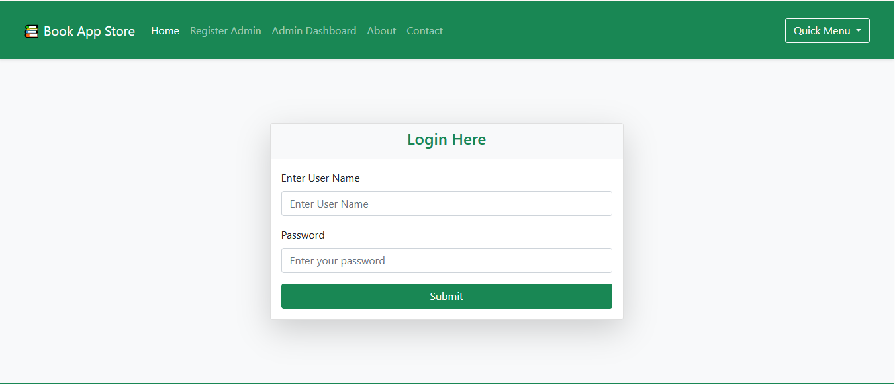
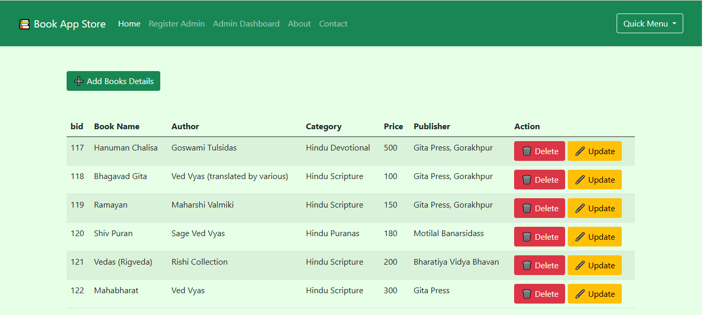

# 📚 Book App Store

A full-featured **Spring Boot web application** for managing books, users, and admin access. This application supports admin registration, login authentication, book listings, and search features — ideal for understanding full-stack development with Spring Boot, Thymeleaf, and Spring Security.

---

## 📌 Table of Contents

- [About the Project](#about-the-project)
- [Features](#features)
- [Tech Stack](#tech-stack)
- [Screenshots](#screenshots)
- [Installation](#installation)
- [Project Structure](#project-structure)
- [Usage](#usage)
- [Security](#security)
- [Contributing](#contributing)
- [License](#license)

---

## 📖 About the Project

This project is designed as a learning-oriented book store management system where:

- Admins can register, log in, and manage book data
- Spring Security handles authentication
- Thymeleaf is used for server-side rendering
- Bootstrap enhances the frontend with responsive UI

---

## ✨ Features

- 🔐 Admin Registration & Login
- 🗃️ Book Listing & Management
- 🔍 Search Functionality
- 🎨 Clean UI with Bootstrap
- 🛡️ Secure Login with Spring Security
- 💾 Backend powered by Spring Data JPA
- 📦 Modular folder structure

---

## 🛠️ Tech Stack

### Backend:
- Java 17+
- Spring Boot
- Spring MVC
- Spring Security
- Spring Data JPA
- Hibernate

### Frontend:
- Thymeleaf
- Bootstrap 5
- HTML/CSS

### Database:
- H2 (In-Memory) / MySQL *(You can switch)*

### Tools:
- Eclipse / IntelliJ IDEA
- Git & GitHub
- Maven

---

## 🖼️ Screenshots

<!-- Add your screenshots in the `screenshots/` folder and link them here -->
| Login Page | Admin Dashboard | Book List |
|------------|------------------|-----------|
|  |  |  |

---

## 📦 Installation

### Prerequisites

- Java JDK 17+
- Maven
- Git

### Clone the Repository

```bash
git clone https://github.com/Ghanshyam2959/book_store_app
cd book-app-store
